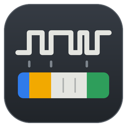
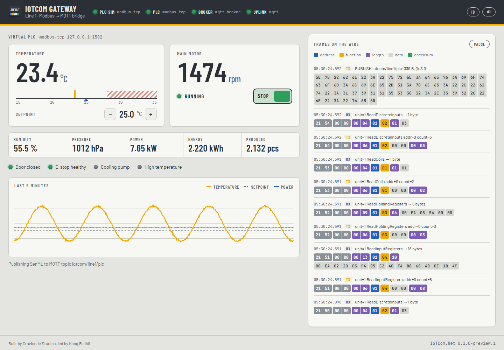
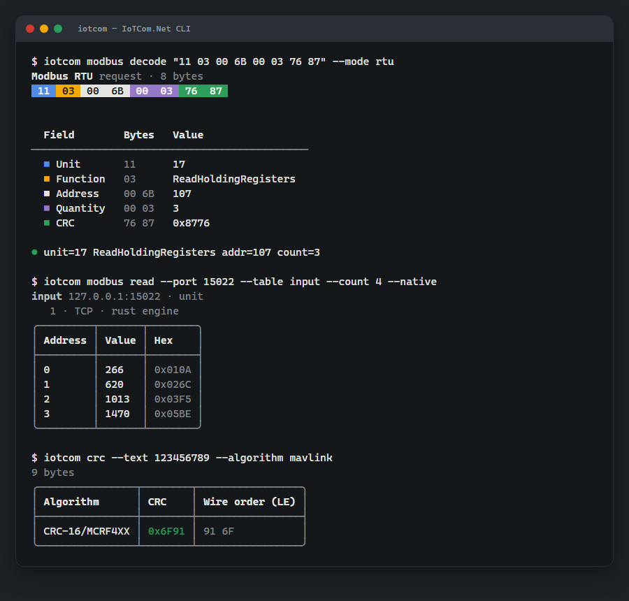

<p align="center"></p>

<h1 align="center">IoTCom.Net</h1>

<p align="center"><b>Library protokol komunikasi IoT yang lengkap untuk .NET 10 — dengan inti Rust di bagian yang penting.</b><br>
Dibuat oleh <b>Gravicode Studios</b> dipimpin oleh <b>Kang Fadhil</b> · <a href="README.md">English</a></p>

<p align="center">


</p>


Satu model yang konsisten — **client, server, publisher, subscriber** — untuk protokol industri, otomotif, navigasi,
pencahayaan, pesan, dan kesehatan. Setiap protokol dilengkapi **simulator**, sehingga semuanya (pengujian, sampel, notebook,
Galeri) berjalan tanpa perangkat keras. Yang sudah dikerjakan .NET dengan baik tidak dibuat ulang; library yang matang
dibungkus; hanya celah nyata yang diimplementasikan — dengan C#, atau dengan Rust yang aman memori di balik C ABI yang
sempit.

```csharp
await using var plc = ModbusClient.Create(o => o.UseTcp("192.168.1.10", 502).WithUnitId(1));
ushort[] registers = await plc.ReadHoldingRegistersAsync(address: 0, count: 10);
```

## Isi

| | |
|---|---|
| **Modbus TCP / RTU / ASCII** | master + slave + simulator PLC virtual, pipelining TCP, mode aman read-only, identifikasi perangkat — dan **mesin Rust** opsional (`NativeModbusClient`) |
| **MAVLink v1 / v2** | dialek common lengkap dari XML resmi (source generator Roslyn — bawa dialek Anda sendiri), signing, link UDP/TCP/serial, helper ground station, simulator quadcopter; codec frame dicerminkan di Rust |
| **NMEA 0183** | parser dan builder dengan validasi checksum, GGA/RMC/GSA/GSV/VTG/GLL/ZDA bertipe, agregator fix GNSS, server NMEA, simulator GPS |
| **Art-Net 4 · sACN (E1.31)** | DMX512 lewat IP: kirim, terima, discovery ArtPoll, multicast, prioritas, model universe dengan fade |
| **CoAP (RFC 7252)** | client + server lewat UDP: pengiriman ulang dan deduplikasi, Observe, Block-wise, penemuan link-format, SenML, simulator rumah kaca; codec dicerminkan oleh crate Rust yang di-fuzz |
| **MQTT 3.1.1 / 5.0** | adapter di atas MQTTnet: subscription `IAsyncEnumerable`, reconnect + resubscribe, helper JSON/SenML, broker tertanam |
| **CAN / CAN FD** | satu `ICanBus` untuk Linux SocketCAN, adapter USB slcan (CANable, CANtact), dan bus virtual; notasi candump, reader terfilter |
| **ISO-TP · UDS · OBD-II** | ISO 15765-2 sebagai state machine **Rust** yang di-fuzz; tester UDS (session, security access, DID, DTC, routine, mode read-only), scan tool OBD-II, dan simulator ECU |
| **HL7 v2 · MLLP** | parser/builder ER7 dengan escaping, pengirim/penerima MLLP dengan pencocokan ACK, tanda vital LOINC, simulator monitor pasien (sepsis, hipoksia, …) |
| **DICOM** | adapter di atas fo-dicom: Storage SCP/SCU (C-STORE, C-ECHO), renderer dengan window ke PNG, studi CT/MR/X-ray sintetis dengan temuan yang ditanam |
| **SenML (RFC 8428)** | JSON + CBOR, tanpa reflection, resolusi base field |
| **Framing** | katalog CRC (23 preset, 8–64 bit), LRC, SLIP, COBS, HDLC, decoder streaming di atas `System.IO.Pipelines` |
| **Core** | transport TCP / serial / in-memory, traffic tap (*frame lane*), metrik & trace OpenTelemetry, kebijakan reconnect, hosting + health check |

Ditambah: aplikasi desktop **Galeri IoTCom.Net**, **CLI `iotcom`**, **ekstensi VS Code** (penampil frame, pemantau lalu lintas), sampel web **edge gateway** dengan dashboard HMI
langsung, sampel console, **template** `dotnet new`, **notebook** Polyglot, dan **dokumentasi dalam English dan
Bahasa Indonesia**.

## Lihat

<table>
<tr><td><br><sub>Edge gateway: Modbus → MQTT dengan dashboard HMI langsung dan isi jalur yang terurai</sub></td>
<td><br><sub>Galeri: setiap frame diurai per field</sub></td></tr>
<tr><td colspan="2"><br><sub>Diagnostik kendaraan: OBD-II dan UDS lewat CAN, ISO-TP di Rust, terhadap ECU mesin simulasi</sub></td></tr>
<tr><td><br><sub>Monitor pasien ICU lewat HL7/MLLP: NEWS2, tren, dan catatan SBAR dari LLM</sub></td>
<td><br><sub>DICOM C-STORE → viewer dengan window → pra-baca model vision</sub></td></tr>
<tr><td colspan="2"><br><sub>Telemetri drone lewat MAVLink: artificial horizon, jejak terbang, dan perintah ber-ACK</sub></td></tr>
<tr><td colspan="2"><br><sub>Rumah kaca CoAP: Observe, Block-wise, dan diagram urutan pesan langsung di jaringan yang kehilangan paket</sub></td></tr>
<tr><td><br><sub>Pelacak GNSS lewat NMEA 0183</sub></td>
<td><br><sub>Lampu panggung lewat Art-Net</sub></td></tr>
<tr><td><br><sub>Meja kerja frame & checksum</sub></td>
<td><br><sub><code>iotcom</code> — urai, baca, CRC dari terminal</sub></td></tr>
</table>

## Mulai

```bash
dotnet add package IoTCom.Net --prerelease            # library (meta-paket)
dotnet tool install -g IoTCom.Net.Cli --prerelease    # CLI iotcom
dotnet new install IoTCom.Net.Templates               # dotnet new iotcom-console / iotcom-worker

iotcom modbus serve --port 1502 --simulate            # PLC virtual…
iotcom modbus read --port 1502 --table input --count 8 --watch 1000   # …dan tampilan langsung
```

Baca [mulai cepat](docs/id/getting-started/quickstart.md), lalu jelajahi [dokumentasi](docs/id/index.md).

## Menjalankan aplikasi dari source

```bash
dotnet run --project gallery/IoTCom.Net.Gallery                          # Galeri desktop
dotnet run --project samples/web/IoTCom.Gateway --urls http://localhost:5080
dotnet run --project samples/console/ModbusMaster -- --simulate
```

## Build dan pengujian

```bash
dotnet build IoTCom.Net.slnx
dotnet test tests/IoTCom.Net.Tests                  # 300+ uji termasuk conformance lintas bahasa
cd rust && cargo test --workspace && cargo build --release   # inti Rust + library native iotcom_modbus
python build/check_docs_parity.py                   # paritas EN/ID + cek tautan
```

## Struktur repositori

```
src/            paket C# (Abstractions, Core, Framing, Transport.Serial, Transport.Can, Protocols.*, Protocols.Hl7, Adapters.Mqtt, Adapters.Dicom, Serialization.SenML, Hosting, Native.Modbus, meta)
rust/           workspace Rust: iotcom-core (Machine sans-I/O), iotcom-ffi-support, iotcom-modbus, cdylib native
conformance/    test vector bersama yang dijalankan C# dan Rust
tests/          uji xUnit
samples/        sampel console dan sampel web IoTCom.Gateway
gallery/        Galeri IoTCom.Net (Avalonia) + perender screenshot headless
tools/          CLI iotcom
templates/      template dotnet new
notebooks/      Polyglot notebook (EN + ID)
docs/           dokumentasi (docs/en, docs/id) dan gambar
build/          cross-build native, gerbang docs/notebook, perkakas screenshot
```

## Proyek

- [PLAN.md](PLAN.md) — roadmap · [Progress.md](Progress.md) — pelacakan pengembangan
- [solution-design.md](solution-design.md) — dokumen desain solusi
- [CONTRIBUTING.md](CONTRIBUTING.md) · [SECURITY.md](SECURITY.md) · [CHANGELOG.md](CHANGELOG.md)
- Lisensi: [Apache-2.0](LICENSE)

---

<p align="center"><sub>IoTCom.Net — dibuat oleh Gravicode Studios dipimpin oleh Kang Fadhil.</sub></p>
