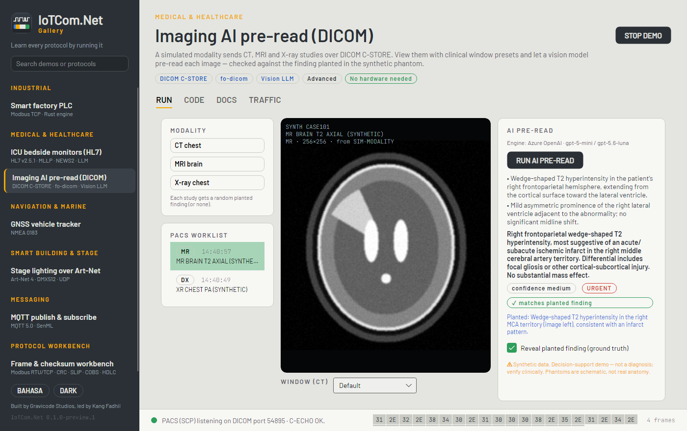

# Medical devices + AI (sample)

This guide explains the two medical demos in the Gallery: how device data reaches a dashboard and how an LLM or
vision model adds a readable summary. Each step is a plain library call that you can reuse in your own gateway.

> **Important.** This is an engineering sample with fictional patients and synthetic images. It is not a medical
> device. AI output can be wrong, and a clinician always makes the decision. Do not send real patient data to an
> external AI service without the approvals and agreements your jurisdiction requires.


## 1 · Bedside monitors → HL7 → clinical dashboard

```
PatientMonitorSimulator ──ORU^R01 over MLLP──▶ Hl7MllpServer ──▶ VitalsAnalyzer ──▶ ward board + monitor
     (4 fictional beds)                         (auto-ACK)           NEWS2, trends,        └─▶ ClinicalAssistant (LLM)
                                                                       anomalies                SBAR note
```

1. **Transport.** Four `PatientMonitorSimulator`s (sepsis, stable, hypoxia, hypertension) send ORU^R01 messages
   through `Hl7MllpClient`s. The demo runs at 10× real time.
2. **Parsing.** `PatientMonitorSimulator.FromOru(message)` (or `GetObservations()` with your own LOINC mapping)
   turns OBX segments into a `VitalsSample`.
3. **Analysis without AI** (`VitalsAnalyzer`, in `samples/shared/IoTCom.Samples.Medical`):
   - **NEWS2** (Royal College of Physicians, 2017) for each parameter and in total, with the risk band: low,
     low–medium (a single 3), medium (5–6) or high (≥ 7). The sample assumes room air and an alert patient.
   - **Trends:** least-squares slope per hour over the window, plus a 15-minute projection and the NEWS2 it implies.
   - **Anomalies:** a z-score against an exponentially weighted mean, to catch sudden changes.
4. **AI summary.** `ClinicalAssistant.SummarizeAsync` sends a compact numeric description (not raw messages) to the
   LLM and asks for an SBAR note of at most 180 words. When no AI is configured, a rule-based template writes the
   note. Each note is stamped with its time and the NEWS2 it was based on, because the board keeps moving.

The scoring is deterministic and testable, so the LLM is used only to *explain*, never to *score*.

## 2 · Modality → DICOM → vision model pre-read


```
SyntheticImaging ──C-STORE──▶ DicomStoreServer ──▶ DicomRenderer (window) ──PNG──▶ vision model ──▶ JSON report
 (CT / MR / X-ray,                (PACS worklist)                                                    findings, impression,
  planted finding)                                                                                    confidence, urgent
```

1. A simulated modality (`DicomStoreClient`, AE `SIM-MODALITY`) stores a synthetic study in the demo PACS
   (`DicomStoreServer`).
2. The viewer renders it with a window preset. CT can be shown with the lung, mediastinum or bone window.
3. `ClinicalAssistant.AnalyzeImageAsync` sends the rendered PNG with the modality and study description, and asks for
   JSON: findings, impression, confidence and urgent. `ParseReport` accepts fenced JSON and salvages truncated
   answers.
4. Synthetic studies have a known answer, so `Mentions(report, truth)` scores the pre-read. It ignores negations
   such as "no pneumothorax" and "tanpa efusi". The demo shows a *matches ground truth* chip.



## Configure an AI provider

The sample talks to any OpenAI-compatible chat API. You can set environment variables, which take priority, or write
`%APPDATA%/IoTCom.Net/ai.json` (`~/.config/IoTCom.Net/ai.json` on Linux and macOS):

| Variable | `ai.json` key | Example |
|---|---|---|
| `IOTCOM_AI_PROVIDER` | `provider` | `azure`, `openai`, `huggingface`, `deepseek` |
| `IOTCOM_AI_ENDPOINT` | `endpoint` | `https://<resource>.openai.azure.com`, `https://router.huggingface.co/v1` |
| `IOTCOM_AI_KEY` | `apiKey` | your key |
| `IOTCOM_AI_MODEL` | `model` | text model, e.g. `gpt-5-mini` |
| `IOTCOM_AI_VISION_MODEL` | `visionModel` | image model (defaults to `model`) |
| `IOTCOM_AI_API_VERSION` | `apiVersion` | Azure only, default `2025-04-01-preview` |

Azure uses `/openai/deployments/{model}/chat/completions` with an `api-key` header. Other providers use
`{endpoint}/chat/completions` with a Bearer token. Keys are never logged or shown; the UI shows only the provider
and model names. Without configuration, both demos still work with the rule-based engine.

## What we measured

With Azure OpenAI (`gpt-5-mini` for text, a vision-capable GPT-5 deployment for images):

- **SBAR notes** were coherent, recognised the sepsis pattern (rising HR/RR/temperature, falling BP) and arrived in
  about 5 s.
- **Image pre-read:** 10 of 12 synthetic modality/finding pairs were correct. The misses were a subtle CT
  pneumothorax (read as normal) and an X-ray consolidation (read as a mass). Schematic phantoms are not real anatomy,
  so treat these numbers as a pipeline test, not as model accuracy.

## Taking it further

- Replace the simulators with real devices: `iotcom hl7 listen` and `iotcom dicom listen` show what your devices send.
- Publish snapshots to MQTT (`AddMqtt`) or forward them to a FHIR server (Firely SDK) from the same host.
- Keep the deterministic part (NEWS2, thresholds, alarms) in code and use the model only for summaries, triage
  suggestions or second reads.

Code: `gallery/IoTCom.Net.Gallery/Demos/BedsideMonitorDemo.cs`, `ImagingDemo.cs`, and
`samples/shared/IoTCom.Samples.Medical/`. See also [HL7 v2](../protocols/hl7.md) and [DICOM](../protocols/dicom.md).
