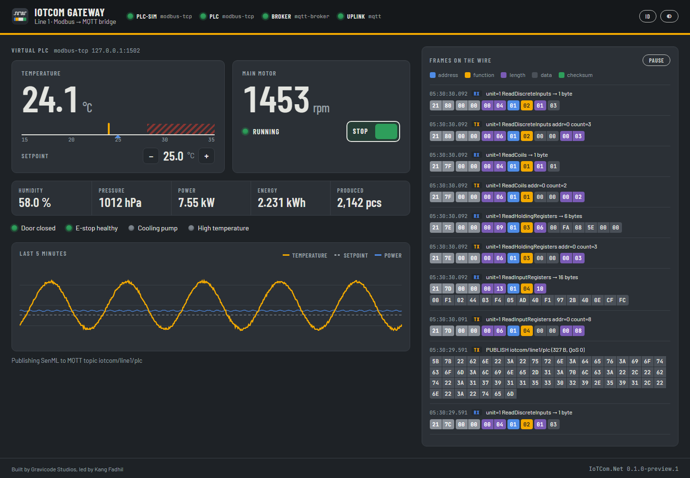

# Sampel edge gateway (IoTCom.Gateway)

`samples/web/IoTCom.Gateway` adalah aplikasi ASP.NET Core lengkap: membaca PLC lewat Modbus TCP, menerbitkan
telemetri SenML ke MQTT, mengekspos API REST + Server-Sent Events, dan menyajikan dashboard HMI langsung. Dengan
pengaturan default, aplikasi membawa PLC virtual dan broker MQTT sendiri, sehingga bisa berjalan di mana saja.

```bash
dotnet run --project samples/web/IoTCom.Gateway --urls http://localhost:5080
```


## Apa yang Anda lihat

- **Nameplate** — satu lampu sinyal per endpoint ter-host (`plc-sim`, `plc`, `broker`, `uplink`), hijau saat sehat.
- **Panel mimic** — suhu terhadap skala setpoint (pita berarsir adalah zona alarm), kecepatan motor dengan sakelar
  run/stop, nilai proses, dan lampu interlock. Stepper setpoint dan sakelar menulis ke PLC.
- **Tren** — lima menit suhu, setpoint, dan daya.
- **Frame di jalur** — setiap request dan response Modbus serta setiap publish MQTT, diurai per field.

Halaman mengikuti preferensi terang/gelap sistem (bisa diubah di header), berganti antara English dan Bahasa
Indonesia, dan tetap rapi hingga lebar ponsel.



## Konfigurasi (`appsettings.json`)

```json
"Gateway": {
  "LineName": "Line 1",
  "Simulate": true,                         // false: tanpa PLC virtual, sambung ke Plc.Host
  "Plc": { "Host": "127.0.0.1", "Port": 1502, "UnitId": 1 },
  "PollIntervalMs": 500,
  "AllowWrites": true,                      // false: dashboard menjadi read-only
  "Mqtt": { "EmbeddedBroker": true, "Host": "127.0.0.1", "Port": 1883, "Topic": "iotcom/line1/plc" }
}
```

## API

| Metode | Path | Deskripsi |
|---|---|---|
| GET | `/api/info` | nama lini, versi, kredit, alamat PLC, topik MQTT |
| GET | `/api/snapshot` | nilai pabrik terbaru |
| GET | `/api/history` | 5 menit terakhir |
| GET | `/api/frames` | frame terurai terakhir |
| GET | `/api/endpoints` | state endpoint |
| GET | `/api/stream` | SSE: event `snapshot` dan `frame` |
| POST | `/api/motor` | `{ "run": true }` → coil 0 |
| POST | `/api/setpoint` | `{ "celsius": 26.5 }` → holding register 0 (5–60 °C) |
| GET | `/health` | health check |

Pantau sisi MQTT dengan `iotcom mqtt sub "iotcom/#"`.

## Cara dibangun

`Program.cs` mendaftarkan endpoint dengan `AddIoTCom`; `GatewayWorker` membaca PLC, membangun pack SenML dan
menerbitkannya, lalu mendorong snapshot dan frame terurai (dari tap hosting bersama) ke client SSE. JSON memakai
context hasil source generator sehingga aplikasi ramah trimming. Dashboard adalah HTML/CSS/JS biasa di `wwwroot`
tanpa langkah build.
