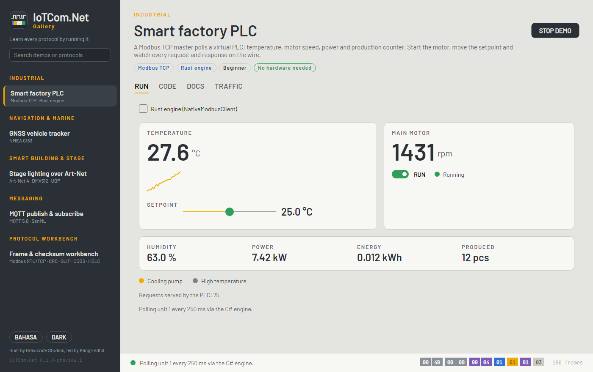

# Dokumentasi IoTCom.Net

**IoTCom.Net** adalah library komunikasi untuk sistem IoT dan embedded di .NET 10, dengan inti Rust untuk bagian
low-level. Satu model yang konsisten — *client, server, publisher, subscriber* — mencakup protokol industri, otomotif, navigasi,
pencahayaan, pesan, dan kesehatan, dan setiap protokol dilengkapi simulator sehingga Anda bisa membangun dan menguji tanpa
perangkat keras.

> Dibuat oleh Gravicode Studios dipimpin oleh Kang Fadhil. · [English](../en/index.md)

## Mulai

| | |
|---|---|
| [Instalasi](getting-started/installation.md) | Paket, platform yang didukung, izin |
| [Mulai cepat](getting-started/quickstart.md) | Membaca PLC (simulasi) dalam 15 baris |
| [Platform & izin](getting-started/platforms.md) | Windows, Linux, macOS, Raspberry Pi, container |

## Pahami

| | |
|---|---|
| [Arsitektur](concepts/architecture.md) | Tier kurasi, lapisan, sans-I/O, peran Rust |
| [Endpoint & transport](concepts/endpoints-and-transports.md) | Peran, siklus hidup, builder, reconnect, model error |
| [Traffic tap & observability](concepts/traffic-tap.md) | Penangkapan frame, frame lane, OpenTelemetry |

## Protokol

| Protokol | Peran | Paket |
|---|---|---|
| [Modbus TCP / RTU / ASCII](protocols/modbus.md) | master · slave · simulator | `IoTCom.Net.Protocols.Modbus` (+ `Native.Modbus`) |
| [OPC UA](protocols/opcua.md) | client · server simulator pabrik (adapter di atas stack OPC Foundation) | `IoTCom.Net.Adapters.OpcUa` |
| [MAVLink v1 / v2](protocols/mavlink.md) | link · ground station · simulator kendaraan · generator dialek | `IoTCom.Net.Protocols.Mavlink` |
| [NMEA 0183 · AIS](protocols/nmea.md) | pembaca · server · simulator · decoder AIS dan pelacak kapal | `IoTCom.Net.Protocols.Nmea` |
| [Art-Net 4 · sACN (DMX512)](protocols/dmx.md) | kirim · terima · discovery | `IoTCom.Net.Protocols.Dmx` |
| [CAN / CAN FD](protocols/can.md) | kirim · terima · SocketCAN · slcan · gs_usb · PCAN · virtual | `IoTCom.Net.Transport.Can` |
| [CANopen (CiA 301)](protocols/canopen.md) | master · perangkat · SDO · PDO · NMT · simulator modul I/O | `IoTCom.Net.Protocols.CanOpen` |
| [SAE J1939](protocols/j1939.md) | truk · PGN/SPN · DM1 · transport protocol · klaim alamat · simulator mesin | `IoTCom.Net.Protocols.J1939` |
| [IEC 60870-5-104](protocols/iec104.md) | master SCADA · RTU · interogasi · select-before-operate · simulator bay penyulang | `IoTCom.Net.Protocols.Iec104` |
| [NTP / SNTP](protocols/ntp.md) | klien SNTP · server · jam melenceng · kiss-o'-death | `IoTCom.Net.Protocols.Ntp` |
| [NFC / NDEF](protocols/nfc.md) | pembaca PC/SC · tag NTAG21x · record NDEF · pembaca virtual | `IoTCom.Net.Protocols.Nfc` |
| [LwM2M](protocols/lwm2m.md) | klien · server · TLV/SenML · observe · simulator lampu jalan | `IoTCom.Net.Protocols.Lwm2m` |
| [Bluetooth LE](protocols/ble.md) | central · GATT · iBeacon/Eddystone · radio virtual (Rust btleplug) | `IoTCom.Net.Transport.Ble` |
| [USB dan HID](protocols/usb.md) | control · bulk · interrupt · report HID · papan relay · bus virtual (Rust nusb/hidapi) | `IoTCom.Net.Transport.Usb` |
| [ISO-TP · UDS · OBD-II](protocols/uds.md) | tester · scan tool · simulator ECU | `IoTCom.Net.Protocols.IsoTp`, `.Uds` |
| [HL7 v2 lewat MLLP](protocols/hl7.md) | kirim · terima · ACK · simulator monitor pasien | `IoTCom.Net.Protocols.Hl7` |
| [ASTM E1394 / LIS2-A2](protocols/astm.md) | penerima (LIS) · pengirim (analyzer) · simulator · jembatan HL7 | `IoTCom.Net.Protocols.Astm` |
| [Perintah AT](protocols/at-commands.md) | client modem · URC · SMS · simulator modul | `IoTCom.Net.Protocols.AtCommand` |
| [DICOM](protocols/dicom.md) | C-STORE SCP/SCU · rendering · studi sintetis | `IoTCom.Net.Adapters.Dicom` |
| [CoAP](protocols/coap.md) | client · server · observe · block-wise · simulator | `IoTCom.Net.Protocols.Coap` |
| [LoRaWAN 1.0.x](protocols/lorawan.md) | network server · gateway Semtech UDP · end device · simulator | `IoTCom.Net.Protocols.LoRaWan` |
| [DLMS/COSEM](protocols/dlms.md) | pembaca meter · simulator meter · HDLC · wrapper · LLS/HLS | `IoTCom.Net.Protocols.Dlms` |
| [M-Bus (berkabel)](protocols/mbus.md) | master · pemindaian · alamat sekunder · simulator | `IoTCom.Net.Protocols.MBus` |
| [MQTT 3.1.1 / 5.0](protocols/mqtt.md) | publish · subscribe · broker | `IoTCom.Net.Adapters.Mqtt` |
| [Sparkplug B](protocols/sparkplug.md) | edge node · host application · simulator lini | `IoTCom.Net.Protocols.Sparkplug` |
| [mDNS / DNS-SD](protocols/mdns.md) | responder · browser · simulator pabrik | `IoTCom.Net.Protocols.Mdns` |
| [Framing & CRC](protocols/framing.md) | codec | `IoTCom.Net.Framing` |
| [SenML](protocols/senml.md) | codec | `IoTCom.Net.Serialization.SenML` |
| [Protobuf · MessagePack · TLV](protocols/payload-codecs.md) | codec · inspeksi tanpa skema | `IoTCom.Net.Serialization.Protobuf`, `.MessagePack`, `.Tlv` |
| Serial RS-232/485 | transport | `IoTCom.Net.Transport.Serial` |

[Roadmap](../../PLAN.md) berisi protokol berikutnya (binding native hasil generate, CAN Kvaser/Vector, protokol Fase 2, …).

## Membangun aplikasi

| | |
|---|---|
| [Hosting & dependency injection](guides/hosting.md) | `AddIoTCom()`, endpoint bernama, health check |
| [Sampel edge gateway](guides/gateway.md) | Jembatan Modbus → MQTT dengan dashboard HMI langsung |
| [Perangkat medis + AI](guides/medical-ai.md) | Tanda vital HL7 → dasbor NEWS2 → catatan LLM; DICOM → pra-baca vision |
| [Simulator](guides/simulators.md) | Mengembangkan dan menguji tanpa perangkat keras |
| [Deployment](guides/deployment.md) | systemd, Windows Service, Docker, NativeAOT |
| [Keamanan & keselamatan](guides/security.md) | Mode read-only, TLS, input tak tepercaya |

## Perkakas

| | |
|---|---|
| [Galeri](tools/gallery.md) | Aplikasi desktop: jalankan setiap protokol, baca kodenya, periksa byte-nya |
| [CLI (`iotcom`)](tools/cli.md) | Baca, tulis, layani, urai dari terminal |
| [Template](tools/templates.md) | `dotnet new iotcom-console`, `iotcom-worker` |
| [Ekstensi VS Code](tools/vscode.md) | Penampil frame, pemantau lalu lintas, tampilan protokol, snippet |
| [Notebook](tools/notebooks.md) | Polyglot notebook per protokol, EN dan ID |

## Di balik layar

- [Lapisan native: Rust & C ABI](native/rust-ffi.md)
- [Berkontribusi protokol](contributing/adding-a-protocol.md)
- [Glosarium](glossary.md)
