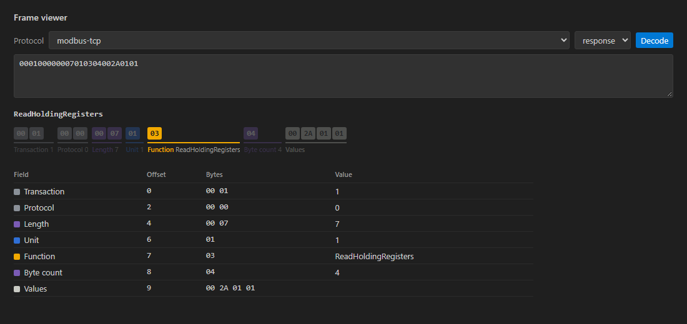
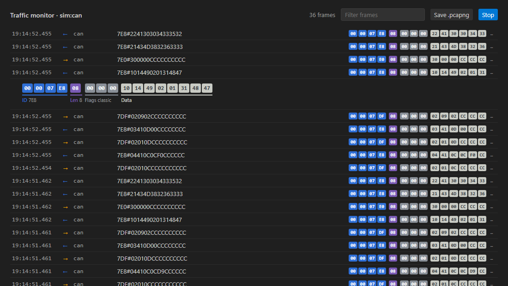

# Ekstensi VS Code: IoTCom.Net Tools

Urai frame, pantau lalu lintas langsung, dan simpan untuk Wireshark tanpa meninggalkan editor. Ekstensi berbicara
dengan CLI `iotcom` lewat JSON-RPC, sehingga hasil penguraiannya sama persis dengan pustaka dan logika protokol tidak
pernah diduplikasi.



## Instalasi

Ekstensi di-build di repositori (`tools/vscode-iotcom`) dan diterbitkan CI sebagai `iotcom-net-tools.vsix`:

```bash
cd tools/vscode-iotcom && npm install && npm run package
code --install-extension iotcom-net-tools.vsix
```

Ekstensi membutuhkan CLI: `dotnet tool install -g IoTCom.Net.Cli --prerelease`. Di clone repositori ini, ekstensi
memakai `tools/iotcom-cli` yang paling baru di-build. Atur **iotcom.cliPath** untuk memakai perintah lain, misalnya
`dotnet /path/to/iotcom.dll`.

## Fitur

| Fitur | Cara memakai |
|---|---|
| **Penampil frame** | pilih byte di file apa pun (hex, berawalan `0x`, atau baris candump), lalu klik kanan **IoTCom: Urai byte yang dipilih**; atau jalankan **IoTCom: Urai sebuah frame…** lalu tempel. Field tampil sebagai frame lane berwarna dengan tabel field; arahkan kursor ke sebuah baris untuk menyorot byte-nya. |
| **Pemantau lalu lintas** | **IoTCom: Mulai pemantau lalu lintas…**, atau klik simulator atau antarmuka CAN di tampilan *Perangkat & simulator*. Saring frame, klik salah satunya untuk membuka lane-nya, lalu **Simpan .pcapng** untuk Wireshark. |
| **Tampilan Protokol** | setiap protokol dengan paket NuGet-nya (klik untuk menyalin `dotnet add package …`), dokumentasi dalam English atau Bahasa Indonesia, notebook, sampel, dan decoder |
| **Snippet** | ketik `iotcom-` di file C#: client dan simulator Modbus, CAN, UDS, CoAP, MAVLink, MQTT, capture pcapng |
| **Bahasa** | English dan Bahasa Indonesia, mengikuti bahasa tampilan VS Code |

Decoder: `modbus-tcp`, `modbus-rtu`, `modbus-ascii`, `can`, `uds`, `coap`, `mavlink`. Sumber pemantau: `sim:modbus`,
`sim:can`, `sim:coap`, `sim:mavlink` (simulator bawaan), `can:<uri>` (misalnya `can:socketcan:can0`, hanya
mendengar), dan `mavlink:udp:<port>`.



## Antarmuka JSON-RPC

Editor dan alat lain bisa memakai antarmuka yang sama. `iotcom rpc` membaca satu request JSON-RPC 2.0 per baris dari
stdin dan menulis respons serta notifikasi ke stdout:

| Method | Parameter | Hasil |
|---|---|---|
| `initialize` | — | versi, kredit, protokol (paket, docs, notebook, sampel, decoder), sumber pemantau |
| `decode` | `protocol`, `hex`, opsional `direction` (`request`/`response`) | `summary`, `hex`, `fields` [{name, offset, length, kind, value}] |
| `devices` | — | port serial, antarmuka SocketCAN, simulator |
| `monitor.start` / `monitor.stop` | `source` / `id` | id pemantau / jumlah frame |
| `monitor.save` | `id`, `path` | pcapng ditulis |
| `shutdown` | — | proses berhenti |

Selama pemantau berjalan, CLI mengirim notifikasi `frame`: monitor, waktu, protokol, arah, hex, ringkasan, dan field.

```bash
echo '{"jsonrpc":"2.0","id":1,"method":"decode","params":{"protocol":"modbus-tcp","hex":"00010000000601030000000A"}}' | iotcom rpc
```

## Pengembangan

`npm test` mengompilasi ekstensi dan menguji klien RPC-nya ujung ke ujung terhadap CLI sungguhan.
`node test/preview.mjs` merender webview di luar VS Code dengan data sungguhan, dan begitulah screenshot di halaman ini
dibuat. Tekan F5 di VS Code dengan `tools/vscode-iotcom` terbuka untuk menjalankan Extension Development Host.
